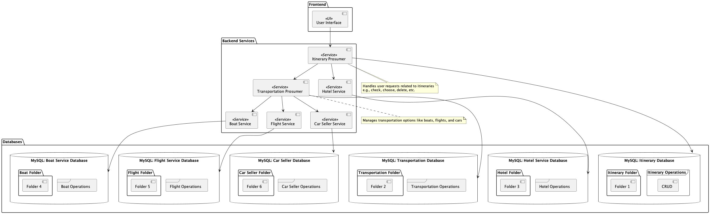
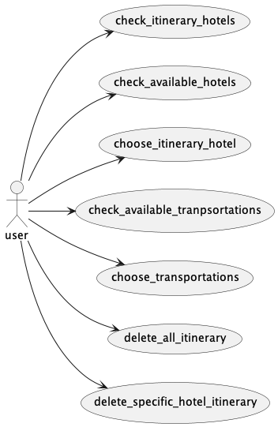
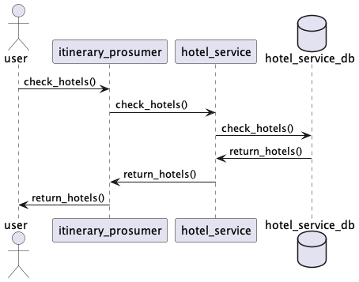
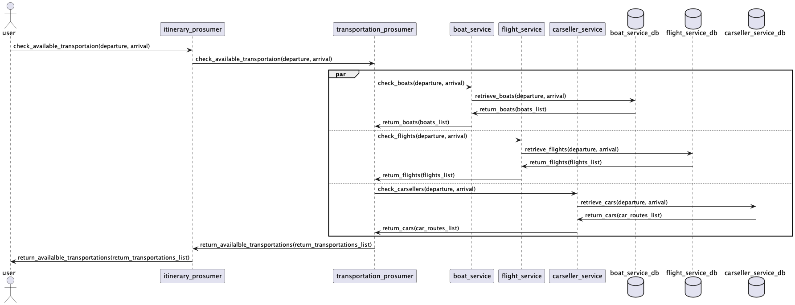
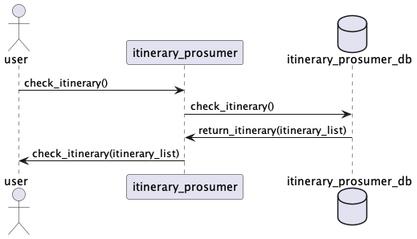
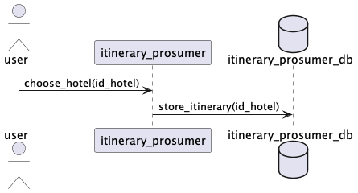
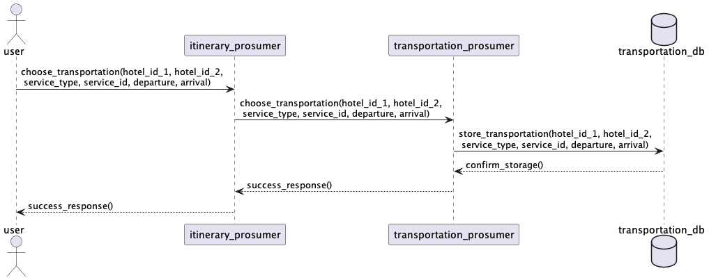
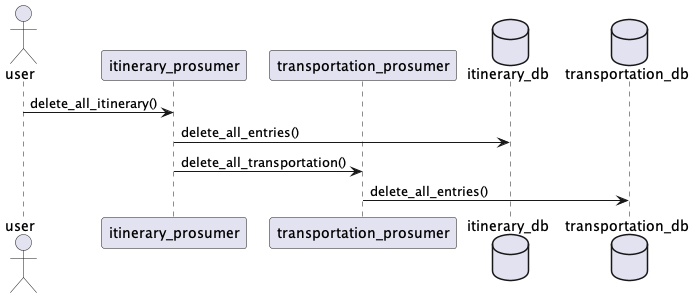
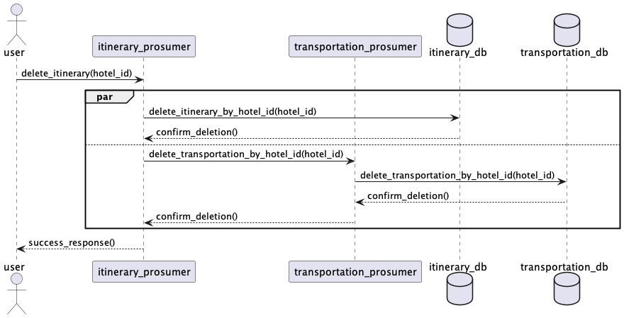

# Travel Itinerary Management System Using (Micro-)SOA Principles

## Table of Contents
1. [Introduction](#introduction)
2. [Goals of the Application](#goals-of-the-application)
3. [Application Structure](#application-structure)
4. [How It Works](#how-it-works)
5. [Asynchronous Processing](#asynchronous-processing)
6. [Scaling and Load Balancing](#scaling-and-load-balancing)
7. [Interaction Scenarios](#interaction-scenarios)
8. [Technologies and Tools](#technologies-and-tools)
9. [Expected Outputs](#expected-outputs)
10. [Project Setup Instructions](#project-setup-instructions)
    - [Prerequisites](#prerequisites)
    - [Steps to Set Up and Run the Project](#steps-to-set-up-and-run-the-project)
    - [Scaling Microservices](#scaling-microservices)
    - [Stopping the Application](#stopping-the-application)

---

## Introduction
The **Travel Itinerary Management System** is a service-oriented application designed to assist users in planning, managing, and modifying their travel itineraries. This system leverages modern **(Micro-)SOA** engineering principles, integrating **REST** and **SOAP** services, **microservices**, and **asynchronous processing** to ensure high scalability, modularity, and user efficiency. 

The project makes use of **Spring Boot**, **Docker**, **Eureka**, and an **API Gateway** for microservice orchestration, following best practices in service-oriented architecture. 

---

## Goals of the Application
- **Comprehensive Itinerary Management**: Manage travel itineraries, including hotel bookings, transportation arrangements, and itinerary synchronization.
- **Asynchronous Coordination**: Demonstrate asynchronous service coordination to handle parallel tasks efficiently.
- **Seamless Integration**: Showcase the integration of REST, SOAP, and microservices within a (micro-)SOA architecture.
- **Scalability & Load Balancing**: Enable load balancing and horizontal scaling for microservices to handle high user demand.

---

## Application Structure
### Core Components
1. **Service Providers**  
   - **Hotel Service (SOAP)**: Manages hotel availability and bookings.  
   - **Boat Service (REST)**: Handles boat transportation.  
   - **Flight Service (REST)**: Manages flight data.  
   - **Car Seller Service (REST)**: Offers car rental options.

2. **Service Prosumers**  
   - **Itinerary Prosumer**: Coordinates itinerary-related tasks (fetching and storing itinerary details). Acts as both a client to providers and a service for clients.  
   - **Transportation Prosumer**: Handles interactions with transportation providers and aggregates data from Boat, Flight, and Car Seller Services.

3. **Client Application**  
   - A web application for user interactions: checking hotels, selecting transportation, and managing itineraries.

4. **Infrastructure Services**  
   - **API Gateway**: Routes and balances requests between clients and microservices.  
   - **Discovery Service (Eureka)**: Ensures dynamic discovery of microservices.




---

## How It Works
1. **Hotel Management**  
   - Users check hotel availability via the **Hotel Service (SOAP)** and select hotels to add to their itinerary.

2. **Transportation Management**  
   - Users search for transportation options between locations.  
   - The **Transportation Prosumer** interacts asynchronously with multiple providers (**Boat**, **Flight**, and **Car Seller** Services) in parallel.  
   - Results are aggregated and refined before responding to the client.

3. **Itinerary Management**  
   - Users can view, modify, and delete itineraries.  
   - These actions involve coordination between the **Itinerary Prosumer** and the **Transportation Prosumer**.

---

## Asynchronous Processing
- **Parallel Data Retrieval**: Retrieve transportation options from Boat, Flight, and Car Seller Services simultaneously, then coordinate data aggregation in the Transportation Prosumer.  
- **Parallel Deletion**: Deletion requests run in parallel in both the Transportation and Itinerary Prosumers.  
- **Justification**: This reduces response time by leveraging parallel execution for high-latency tasks, enhancing user experience.

---

## Scaling and Load Balancing
- **Justification**: The system is designed to handle high traffic during peak travel seasons. Load balancing ensures even distribution of user requests, while microservices deployed in multiple instances provide fault tolerance and scalability.  
- **Implementation**:  
  - **Docker** is used to deploy microservices in scalable containers.  
  - **Eureka** and **OpenFeign** handle service discovery and load balancing.

---

## Interaction Scenarios
1. **Check Hotel Availability**  
   - The client sends a request to the **Itinerary Prosumer**.  
   - The Itinerary Prosumer invokes the **Hotel Service (SOAP)** to fetch available hotels and responds to the client.

2. **Choose Transportation**  
   - The client requests transportation options from the **Itinerary Prosumer**.  
   - The Itinerary Prosumer forwards the request to the **Transportation Prosumer**.  
   - The Transportation Prosumer interacts asynchronously with **Boat**, **Flight**, and **Car Seller** Services, aggregates results, and returns them.

3. **Manage Itinerary**  
   - Users can view, modify, or delete itineraries via the **Itinerary Prosumer**.  
   - These actions involve CRUD operations on the Itinerary and Transportation databases.
# Diagrams

Below are collapsible sections for each sequence diagram. Click on a section to expand and view its contents.

<details>
<summary><strong>Check Available Hotels Sequence</strong></summary>



</details>

<details>
<summary><strong>Check Available Transportations Sequence</strong></summary>



</details>

<details>
<summary><strong>Check Itinerary Sequence</strong></summary>



</details>

<details>
<summary><strong>Choose Hotels Sequence</strong></summary>



</details>

<details>
<summary><strong>Choose Transportation Sequence</strong></summary>



</details>

<details>
<summary><strong>Delete All Itinerary Sequence</strong></summary>



</details>

<details>
<summary><strong>Delete Specific Hotel Itinerary</strong></summary>



</details>


---

## Technologies and Tools
- **Frameworks**: Spring Boot  
- **Architecture**: Microservices with REST and SOAP  
- **Containers**: Docker for microservice deployment  
- **API Management**: API Gateway, Swagger for REST documentation  
- **Discovery Service**: Eureka  
- **Load Balancing**: Horizontal scaling with Eureka and OpenFeign  
- **Database**: MySQL or PostgreSQL (configurable)  
- **Asynchronous Execution**: Java’s `CompletableFuture` and Spring asynchronous programming

---

## Expected Outputs
- A fully functional travel itinerary management system with modular services and a responsive client interface.  
- Demonstration of **asynchronous service coordination** and **load-balanced microservices**.  
- Clear **sequence diagrams**, **architectural diagrams**, and comprehensive project documentation.

---

## Project Setup Instructions

### Prerequisites
1. **Database Setup**  
   - Set up a PostgreSQL (or MySQL) database.  
   - Run SQL commands (in `create_tables.sql` and `create_db.sql`) to initialize the database schema.  
   - Ensure that database access details are correctly configured in the various `application.properties` or `application.yml` files.

2. **Install Docker**  
   - [Download and install Docker](https://www.docker.com/products/docker-desktop)  
   - Ensure Docker is running on your machine.

### Steps to Set Up and Run the Project
1. **Build the Docker Images**  
   ```bash
   docker-compose build
   ```
2. **Run the Application**  
    docker-compose up
    Note: You may need to wait a minute or two for all services to register with Eureka.

2. **Access the Application**

-    Eureka Dashboard: http://localhost:8761
-    API Gateway: http://localhost:8080
-    Front-End Interface: http://localhost:8083/hotels
-    Swagger Documentation (each REST service):
-    Boat REST Service: http://localhost:8081/swagger-ui.html
-    Flight REST Service: http://localhost:8082/swagger-ui.html
-    Hotel REST Service: http://localhost:8084/swagger-ui.html
-    Itinerary REST Prosumer: http://localhost:8085/swagger-ui.html
-    Transportation REST Prosumer: http://localhost:8086/swagger-ui.html
## Scaling Microservices

To scale a specific microservice, use the `--scale` option with `docker-compose up`. For example:

```bash
docker-compose up --scale transportation-rest-prosumer=3
```
## Stopping the Application
To stop all running containers:
```bash
docker-compose down
```
